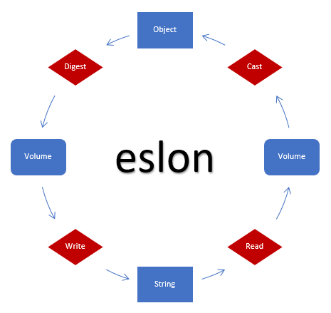
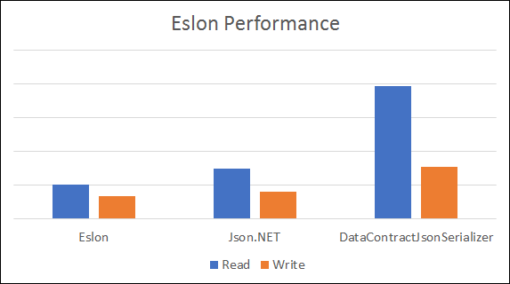



Eslon (S-LON, "Single Line Object Notation") is a hybrid serialization library for .NET, combining JSON and the Windows-themed Eslon syntax.

- [Syntax](Documentation/Syntax.md)
- [Test cases](Documentation/Output.md)

──────────────────────────────────────────────────

## Examples
Serialize your data:
```csharp
EslonAccess.Write(DateTime.Now); // "2017-03-21T17:04:19.818+01:00"
```

Deserialize your data:
```csharp
EslonAccess.Read("2017-03-21T17:04:19.818+01:00"); // {3/21/2017 5:04:19 PM}
```

### Architecture


### Benchmark

